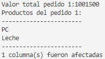
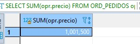
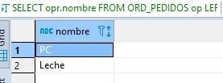
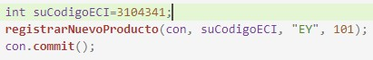
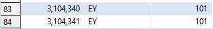

# Daniel Felipe Rincón Muñoz

## Sección I. - Introducción a JDBC
***
**Punto 8. Verificación de resultados correctos**

*Resultado PreparedStatement:*

*Verificación de resultados*

*Inserción de dato*

***
## Sección II. - Introducción a MyBatis
### PARTE I

***
**Punto 1. Resultado de la consulta**

